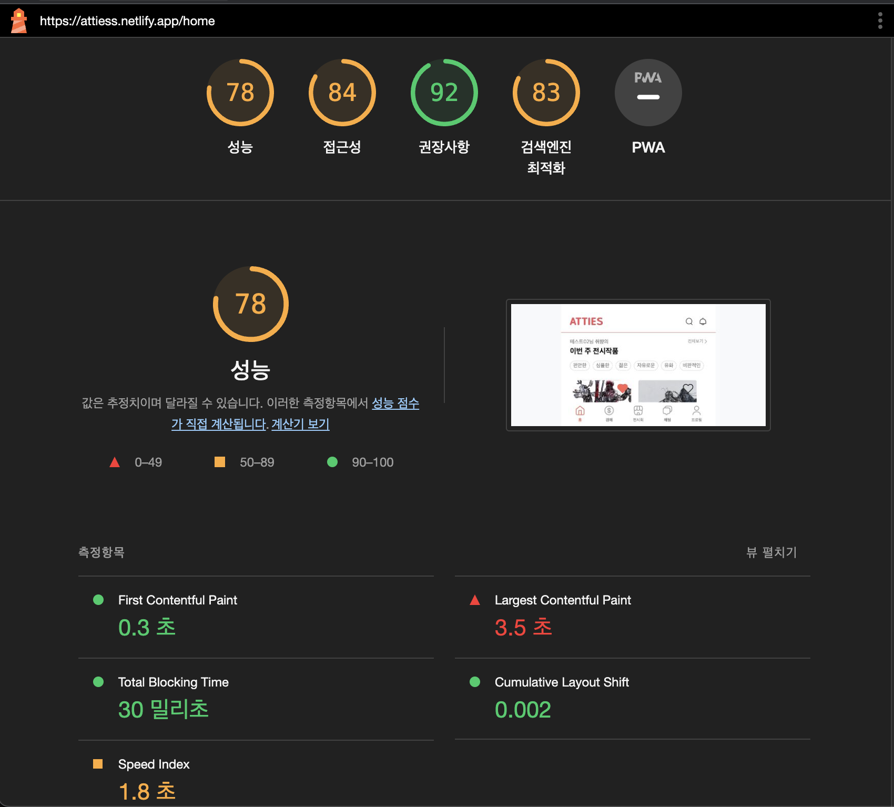
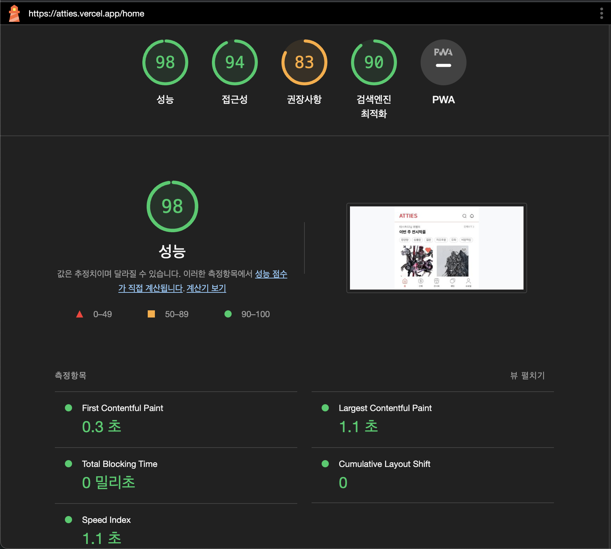

# Atties - Frontend

## 목차

1. [프로젝트 소개 🎨](#프로젝트-소개-🎨)
2. [프로젝트 성능 향상 보고서 📈](#프로젝트-성능-향상-보고서-📈)
3. [컨밴션 🌈](#컨밴션-🌈)
4. [프로젝트 기술스택 🛠](#프로젝트-기술스택-🛠)
5. [우리의 성장기](#우리의-성장기)
6. [폴더 구조 📁](#폴더-구조-📁)

## Links

### [Ver 1.0 Github](https://github.com/Att-ies)
### [Ver 2.0 서비스 링크](https://atties.vercel.app/)

# Atties Ver.2.0 업데이트 내역
## 리팩토링 및 성능 개선

<aside>
🎯 리팩토링의 주된 목표는 페이지 로딩 속도와 보안성능의 향상입니다.

</aside>

## 1. 렌더링 최적화

- `React.memo`를 활용하여 이전에 렌더링한 결과를 메모이징하고, 이후 동일한 props로 렌더링 되는 경우 재사용하여 렌더링을 최적화하였습니다.
- 이 방법을 사용함으로써, 복잡한 컴포넌트의 렌더링 횟수를 줄이고 페이지 로드 시간을 단축시키는 데 크게 기여하였습니다.
- 기존 서비스(좌), 리팩토링 후 서비스(우)

## 2. Server Side에서 Data 받아오기
- 기존 서비스

- 리팩토링 후 서비스

- 서버로부터 HTML을 받아온 이후에 데이터를 동기적으로 가져오는 기존의 방식을 개선하였습니다.
- 이제는 서버에서 먼저 데이터를 불러와 HTML을 생성하고, 이를 클라이언트에 전달하는 서버 사이드 렌더링(SSR) 방식을 사용합니다.
- 이로 인해 초기 로딩 속도가 크게 향상되었습니다.
- 홈 화면과 프로필 페이지 같은 페이지가 자주 변경되지 않는 부분에 대해서는, CSR보다는 SSR 방식이 더 적합하다고 판단하였습니다.

## 3. 토큰 저장 위치 변경

- 기존에는 localStorage에 Access Token과 Refresh Token을 저장하는 방식을 사용했으나, 이 방식은 XXR 공격에 대해 매우 취약하다는 결정적인 단점이 있었습니다.
- 이를 보완하기 위해, Access Token과 Refresh Token을 http only Cookie에 저장하도록 방식을 개선하였습니다.
- [고민의 흔적](https://github.com/guesung/atties-ver2.0/issues/11)

## 4. 반응형 개선
- 기존 서비스

- 리팩토링 후 서비스

- px 단위를 rem으로 변경하여 화면 크기에 맞게 반응형 디자인을 구현하였습니다.

---

# 성능 향상 결과

### 기존 LCP 3.5초 → 1.1초로 향상

- 기존 서비스

- 리팩토링 후 서비스

- 기존 서비스

<video src="RPReplay_Final1686795768.mp4" controls title="Title"></video>

- 리팩토링 후 서비스

<video src="RPReplay_Final1686795824%20(1).mp4" controls title="Title"></video>
---

## 컨밴션 🌈

[📄 네이밍 컨벤션](https://www.notion.so/guesung/f6bf625c22514d8a8a9793d551935a10?pvs=4)

[📄 타입스크립트 컨밴션](https://www.notion.so/guesung/typescript-convention-e335832c4c0e420f85a9f7de6b5d0db1?pvs=4)

[📄 Git 컨밴션](https://www.notion.so/guesung/PR-59399896b4504c4ea5703b8c3ac2b874)

## 프로젝트 기술스택 🛠

- **Language :** [Typescript](https://www.typescriptlang.org/)
- **Framework :** [Next.js](https://nextjs.org/)
- **Package Manager :** [yarn-berry](https://yarnpkg.com/)
- **State Management :** [React Query](https://react-query.tanstack.com/), [Redux Toolkit](https://redux-toolkit.js.org/)
- **Styling :** [TailwindCSS](https://tailwindcss.com/), [tailwind-styled-components](https://www.npmjs.com/package/tailwind-styled-components), [HeadlessUI](https://headlessui.com/), [Swiper](https://swiperjs.com/react)
- **Forms :** [React Hook Form](https://react-hook-form.com/)
- **Formatter :** [ESLint](https://eslint.org/), [Prettier](https://prettier.io/)
- **Library :** [axios](https://axios-http.com/), [sockJS](https://github.com/sockjs/sockjs-client), [momentJS](https://momentjs.com/)

## 우리의 성장기

[🗝️ 카카오, 네이버 소셜 로그인](https://www.notion.so/guesung/social-login-4d9321791dec42a6a98590cf18a0dbb5?pvs=4)

[🧿 axios instance로 api 요청 전후 및 error 핸들링](https://www.notion.so/guesung/Axios-instance-53e9a3c00f354b8c92b44728f9987b3c?pvs=4)

[💧 react-query 제대로 알고 사용하기 ](https://www.notion.so/guesung/react-query-e32b280a1b184cd7b5ba699286a20604?pvs=4)

[🐽 Intersection Observer API와 react-query 사용하여 무한스크롤 구현](https://www.notion.so/guesung/Intersection-Observer-API-react-query-7e95dd67a0aa4830be0685e74e8093f0)

[🎨 tailwind-styled-component](https://www.notion.so/guesung/tailwind-styled-components-e8b95344e93d4ca88979b702deb7027e)

[💬 채팅, stompjs, socketjs](https://www.notion.so/guesung/Stomp-Soket-js-51dfc4ba27f94026bec470da0170ea01?pvs=4)

[🧡 스토리북 in nextjs and tailwind](https://www.notion.so/guesung/story-book-with-nextjs-and-tailwind-280f912916084649ad8d73e4e7b75abf?pvs=4)

[👣 @types 폴더에서 전역 type 정의](https://www.notion.so/guesung/types-type-7aeefdf592894c0d9a6f99993ba2a75e?pvs=4)

## 폴더 구조 📁

### 전체 구조

    ├── .yarn
    ├── .storybook              #
    ├── public                  #
    ├── src                     #
        ├── @types              #
        ├── apis                #
        ├── components          #
            ├── common          #
            ├── auction         #
            ├── auth            #
            └── ...             #
        ├── features            #
        ├── hooks               #
        ├── pages               #
        ├── stories             #
        ├── styles              #
        ├── utils               #
    ├── README.md               #
    └── ...

### apis

Api 요청과 관련한 함수들 입니다.

    .
    ├── apis
    │   ├── _axios
    │       └── instance.ts      # api instance를 만들어서 사용합니다.
    │   ├── admin                # api class를 만들고 비동기 함수들을 작성합니다.
    │   ├── artwork
    │   ├── aution
    └── ...

### components

공통 컴포넌트와 페이지 단위로 필요한 컴포넌트로 분리하여 관리합니다.

    .
    ├── ...
    ├── components
    │ ├── common
    │   ├── Button
    │   ├── Layout
    │   ├── Input
    │   ├── Modal
    │   └── ...
    │ ├── auction
    │ ├── chat
    │ ├── exhibition
    │ └── ...
    └── ...

### hooks

useQuery, useMutation으로 mapping한 query, mutation hook들과 개별 hook들을 작성합니다.

      .
    ├── ...
    ├── hooks
    │ ├── mutations
    │ ├── queries
    │ ├── useCountDown.ts
    │ ├── useInterval.ts
    │ └── ...
    └── ...
